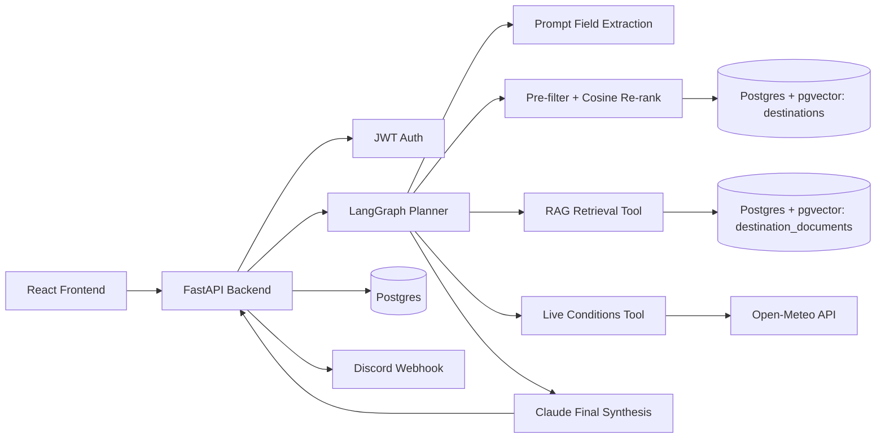

# Pre-filter + Cosine Re-rank Recommendation Node Implementation Plan

> **For agentic workers:** REQUIRED SUB-SKILL: Use superpowers:subagent-driven-development (recommended) or superpowers:executing-plans to implement this plan task-by-task. Steps use checkbox (`- [ ]`) syntax for tracking.

**Goal:** Replace the SVC travel-style classifier + CSV hand-weighted scorer in the LangGraph trip-planner pipeline with a single node that does a structured SQL pre-filter over the `destinations` table followed by a pgvector cosine re-rank, returning a full ranked slate with a feature snapshot per candidate.

**Architecture:** One new async service function (`recommend_destinations` in a new `app/services/destination_recommendations.py`) embeds the raw user prompt with Voyage (`input_type=query`), runs a single SQLAlchemy `select` against `Destination` with hard-constraint `WHERE` clauses (budget ceiling, region, dormant tag-weight threshold) ordered by `embedding.cosine_distance(...)` (compiles to pgvector's `<=>`, using the existing `ix_destinations_embedding_hnsw` index), and re-queries once with constraints dropped if fewer than `min_candidates` rows survive. The existing `classify_node` is deleted from `app/agent/graph.py` and `recommend_destinations_node` is rewritten to call this service directly (no predicted travel style involved anywhere in this path). The old SVC classifier (`best_model.joblib`, `app/services/classifier.py`) and the CSV hand-weighted scorer (`app/services/recommendations.py`) are left on disk untouched but are no longer imported by anything in the request path; the standalone `/tools/classify-travel-style` HTTP endpoint is untouched and keeps working independently.

**Tech Stack:** FastAPI, SQLAlchemy 2.x async (asyncpg), pgvector-sqlalchemy (`Vector`, `.cosine_distance()`), Postgres/pgvector with an existing HNSW (`vector_cosine_ops`) index, Pydantic v2, LangGraph.

## Global Constraints

- Async everywhere: the new service function and every DB/HTTP call inside it use `async`/`await` (no `requests`, no blocking calls in a request path).
- Use pgvector's `<=>` operator via `Destination.embedding.cosine_distance(...)` (never compute cosine similarity in Python over fetched rows) so the HNSW index can be used.
- No classifier and no `predicted_style` anywhere in the new recommendation path (graph state, tool_logs, response text) — the standalone classifier route/tool/service files are left alone and are out of scope.
- Graceful empty-filter fallback: if the filtered pre-filter query returns fewer than `min_candidates` rows, re-run once with all hard constraints dropped (never return an empty result just because filters were too strict) rather than raising or short-circuiting.
- Required-tags filtering is implemented for real (SQL-level, JSONB weight threshold) but defaults to an empty list and is not exercised by the graph node yet — `tag_definitions` is empty and `destinations.tags` is still keyed by raw `cluster_id` until the (separately blocked) clustering Phase 2/3 lands real tag names. Do not wire the graph node to send `required_tags`.
- Budget ceiling means "at or below the requested level, OR the destination's `budget_level` is `NULL`" (nulls pass through — ~35% of the corpus has no Numbeo coverage; excluding them would starve the pre-filter and trigger the relax fallback on almost every run).
- Region hard-filter is skipped (treated as "no preference") when the requested region is `None` or the literal string `"Flexible"` (case-insensitive) — this is the extraction prompt's own documented "unclear" sentinel (`app/prompts/request_field_extraction_prompt.txt`: *"If region is unclear, use 'Flexible'"*), not a new invented rule.
- The user profile text embedded in step 1 is the raw trip-request prompt (`state["prompt"]`), not a synthesized structured-field sentence — destination embeddings were built from Wikivoyage prose via the same Voyage model, so natural language shares that embedding space better.
- This project has no automated test suite and none should be introduced by this task (see `CLAUDE.md` "Known gaps"). Verification is manual: `uv run python -` scratch scripts (via stdin heredoc, nothing committed) using `httpx.MockTransport` to fake the Voyage HTTP call, run against the real local dev Postgres (already running via `docker compose up -d db`, already populated with 219 real destinations with real embeddings), plus a raw `EXPLAIN ANALYZE` to inspect the query plan.
- Leave these files completely untouched: `backend/artifacts/ml/best_model.joblib`, `backend/app/services/classifier.py`, `backend/app/services/recommendations.py`, `backend/app/agent/tools/classifier_tool.py`, `backend/app/api/routes/classifier.py`, `backend/app/schemas/classifier.py`, `backend/app/agent/tools/registry.py`, `backend/app/core/lifespan.py`, `backend/app/api/routes/health.py`.

---

## File Structure

**Create:**
- `backend/app/services/destination_recommendations.py` — the new pre-filter + cosine re-rank service. Owns the SQL query, the relax-fallback, and the three feature-snapshot helper functions.

**Modify:**
- `backend/app/schemas/recommendations.py` — replace the travel-style-keyed request/response shape with the new query-text/constraints request and the ranked-slate + feature-snapshot response.
- `backend/app/agent/tools/recommendations_tool.py` — call the new service instead of the CSV-based one; require `context.session` and `context.http_client`.
- `backend/app/api/routes/recommendations.py` — take a DB session dependency, call the new service.
- `backend/app/agent/graph.py` — delete `classify_node`, delete `predicted_style` from `TripPlannerState`/`initialize_trip_state`, rewrite `recommend_destinations_node` to build the new request and skip the classifier gate entirely, strip `predicted_style` references out of `synthesize_response_node`, remove the `classify` node/edges from `build_trip_planner_graph`.
- `README.md` (repo root) — Demo Flow, Architecture mermaid diagram, Agent Design / Current Graph Steps, Tools list: reflect the collapsed node and the classifier retirement.
- `backend/README.md` — fix the now-stale "not yet wired into the agent" line in "Destination Corpus Ingestion", add a new "Destination Recommendation (Pre-filter + Cosine Re-rank)" section documenting the query, the relax fallback, the dormant tag filter, and the `EXPLAIN ANALYZE` finding.

---

### Task 1: New request/response schemas

**Files:**
- Modify: `backend/app/schemas/recommendations.py`

**Interfaces:**
- Produces: `DestinationRecommendationRequest(query_text: str, budget_level: Level | None, region: str | None, required_tags: list[str], tag_weight_threshold: float, limit: int, min_candidates: int)`, `DestinationFeatureSnapshot(cosine_sim: float, tag_match_count: int, budget_delta: int | None, region_match: bool)`, `DestinationRecommendationItem(destination_id: uuid.UUID, destination: str, country: str, region: str | None, budget_level: Level | None, score: float, rank_position: int, features: DestinationFeatureSnapshot)`, `DestinationRecommendationResponse(query_text: str, count: int, used_relaxed_constraints: bool, results: list[DestinationRecommendationItem])`. Task 2 (service), Task 3 (tool), Task 4 (route), Task 5 (graph) all import these exact names from `app.schemas.recommendations`.

- [ ] **Step 1: Replace the file contents**

Replace the entire contents of `backend/app/schemas/recommendations.py` with:

```python
import uuid
from typing import Literal

from pydantic import BaseModel, Field

Level = Literal["low", "medium", "high"]


class DestinationRecommendationRequest(BaseModel):
    query_text: str = Field(min_length=1, max_length=4000)
    budget_level: Level | None = None
    region: str | None = Field(default=None, min_length=1, max_length=100)
    required_tags: list[str] = Field(default_factory=list)
    tag_weight_threshold: float = Field(default=0.5, ge=0.0, le=1.0)
    limit: int = Field(default=5, ge=1, le=20)
    min_candidates: int = Field(default=10, ge=1, le=50)


class DestinationFeatureSnapshot(BaseModel):
    cosine_sim: float
    tag_match_count: int
    budget_delta: int | None
    region_match: bool


class DestinationRecommendationItem(BaseModel):
    destination_id: uuid.UUID
    destination: str
    country: str
    region: str | None
    budget_level: Level | None
    score: float
    rank_position: int
    features: DestinationFeatureSnapshot


class DestinationRecommendationResponse(BaseModel):
    query_text: str
    count: int
    used_relaxed_constraints: bool
    results: list[DestinationRecommendationItem]
```

- [ ] **Step 2: Verify it imports and validates**

Run (from `backend/`):

```bash
uv run python - <<'PY'
import uuid
from app.schemas.recommendations import (
    DestinationFeatureSnapshot,
    DestinationRecommendationItem,
    DestinationRecommendationRequest,
    DestinationRecommendationResponse,
)

req = DestinationRecommendationRequest(query_text="a relaxing beach trip in Southeast Asia")
assert req.budget_level is None
assert req.required_tags == []
assert req.min_candidates == 10

item = DestinationRecommendationItem(
    destination_id=uuid.uuid4(),
    destination="Bali",
    country="Indonesia",
    region="Southeast Asia",
    budget_level="medium",
    score=0.812,
    rank_position=1,
    features=DestinationFeatureSnapshot(
        cosine_sim=0.812, tag_match_count=0, budget_delta=None, region_match=True
    ),
)
resp = DestinationRecommendationResponse(
    query_text=req.query_text, count=1, used_relaxed_constraints=False, results=[item]
)
assert resp.model_dump(mode="json")["results"][0]["destination_id"] == str(item.destination_id)
print("schema OK")
PY
```

Expected: prints `schema OK` with no traceback.

- [ ] **Step 3: Commit**

```bash
git add backend/app/schemas/recommendations.py
git commit -m "feat(recommendations): replace travel-style schema with pre-filter+cosine shape"
```

---

### Task 2: New pre-filter + cosine re-rank service

**Files:**
- Create: `backend/app/services/destination_recommendations.py`

**Interfaces:**
- Consumes: `Destination` (`app.db.models.destination`, fields `id: uuid.UUID`, `name: str`, `country: str`, `region: str | None`, `budget_level: str | None`, `tags: dict`, `embedding: list[float] | None`, `deleted_at: datetime | None`); `embed_texts(http_client, settings, texts, *, input_type)` from `app.services.voyage_embeddings` (already used identically by `app.services.rag_retrieval`); schemas from Task 1.
- Produces: `async def recommend_destinations(session: AsyncSession, http_client: httpx.AsyncClient, settings: Settings, payload: DestinationRecommendationRequest) -> DestinationRecommendationResponse`. Task 3 (tool) and Task 4 (route) call this exact signature.

- [ ] **Step 1: Write the service**

Create `backend/app/services/destination_recommendations.py`:

```python
from collections.abc import Sequence

import httpx
from sqlalchemy import Float, cast, func, or_, select
from sqlalchemy.ext.asyncio import AsyncSession

from app.core.config import Settings
from app.db.models.destination import Destination
from app.schemas.recommendations import (
    DestinationFeatureSnapshot,
    DestinationRecommendationItem,
    DestinationRecommendationRequest,
    DestinationRecommendationResponse,
)
from app.services.voyage_embeddings import embed_texts

BUDGET_ORDER: dict[str, int] = {"low": 0, "medium": 1, "high": 2}
NO_REGION_PREFERENCE = "flexible"


async def recommend_destinations(
    session: AsyncSession,
    http_client: httpx.AsyncClient,
    settings: Settings,
    payload: DestinationRecommendationRequest,
) -> DestinationRecommendationResponse:
    query_text = payload.query_text.strip()
    query_embedding = (
        await embed_texts(http_client, settings, [query_text], input_type="query")
    )[0]

    fetch_limit = max(payload.limit, payload.min_candidates)

    rows = await _fetch_ranked_candidates(
        session, payload, query_embedding, fetch_limit=fetch_limit, apply_filters=True
    )
    used_relaxed_constraints = False
    if len(rows) < payload.min_candidates:
        rows = await _fetch_ranked_candidates(
            session, payload, query_embedding, fetch_limit=fetch_limit, apply_filters=False
        )
        used_relaxed_constraints = True

    ranked = rows[: payload.limit]
    results = [
        DestinationRecommendationItem(
            destination_id=destination.id,
            destination=destination.name,
            country=destination.country,
            region=destination.region,
            budget_level=destination.budget_level,
            score=round(1.0 - distance, 4),
            rank_position=index + 1,
            features=DestinationFeatureSnapshot(
                cosine_sim=round(1.0 - distance, 4),
                tag_match_count=_count_matching_tags(
                    destination.tags, payload.required_tags, payload.tag_weight_threshold
                ),
                budget_delta=_budget_delta(destination.budget_level, payload.budget_level),
                region_match=_region_match(destination.region, payload.region),
            ),
        )
        for index, (destination, distance) in enumerate(ranked)
    ]

    return DestinationRecommendationResponse(
        query_text=query_text,
        count=len(results),
        used_relaxed_constraints=used_relaxed_constraints,
        results=results,
    )


async def _fetch_ranked_candidates(
    session: AsyncSession,
    payload: DestinationRecommendationRequest,
    query_embedding: list[float],
    *,
    fetch_limit: int,
    apply_filters: bool,
) -> list[tuple[Destination, float]]:
    distance_expr = Destination.embedding.cosine_distance(query_embedding)
    statement = (
        select(Destination, distance_expr.label("distance"))
        .where(Destination.deleted_at.is_(None))
        .where(Destination.embedding.is_not(None))
    )

    if apply_filters:
        if payload.budget_level is not None:
            ceiling = BUDGET_ORDER[payload.budget_level]
            allowed_levels = [
                level for level, order in BUDGET_ORDER.items() if order <= ceiling
            ]
            statement = statement.where(
                or_(
                    Destination.budget_level.in_(allowed_levels),
                    Destination.budget_level.is_(None),
                )
            )

        if (
            payload.region is not None
            and payload.region.strip().casefold() != NO_REGION_PREFERENCE
        ):
            statement = statement.where(
                func.lower(Destination.region) == payload.region.strip().casefold()
            )

        for tag in payload.required_tags:
            statement = statement.where(
                cast(Destination.tags[tag].astext, Float) >= payload.tag_weight_threshold
            )

    statement = statement.order_by(distance_expr).limit(fetch_limit)
    rows = (await session.execute(statement)).all()
    return [(row[0], float(row[1])) for row in rows]


def _count_matching_tags(
    tags: dict,
    required_tags: Sequence[str],
    threshold: float,
) -> int:
    return sum(1 for tag in required_tags if float(tags.get(tag, 0.0)) >= threshold)


def _budget_delta(destination_budget: str | None, requested_ceiling: str | None) -> int | None:
    if destination_budget is None or requested_ceiling is None:
        return None
    return BUDGET_ORDER[destination_budget] - BUDGET_ORDER[requested_ceiling]


def _region_match(destination_region: str | None, requested_region: str | None) -> bool:
    if requested_region is None or requested_region.strip().casefold() == NO_REGION_PREFERENCE:
        return True
    if destination_region is None:
        return False
    return destination_region.casefold() == requested_region.strip().casefold()
```

- [ ] **Step 2: Verify the pure helper functions**

Run (from `backend/`):

```bash
uv run python - <<'PY'
from app.services.destination_recommendations import (
    _budget_delta, _count_matching_tags, _region_match,
)

assert _count_matching_tags({"beach": 0.9, "hiking": 0.2}, ["beach", "hiking"], 0.5) == 1
assert _count_matching_tags({}, [], 0.5) == 0
assert _budget_delta("high", "low") == 2
assert _budget_delta(None, "low") is None
assert _budget_delta("low", None) is None
assert _region_match("Southeast Asia", "southeast asia") is True
assert _region_match("Southeast Asia", "Flexible") is True
assert _region_match("Southeast Asia", None) is True
assert _region_match(None, "Europe") is False
assert _region_match("Europe", "Asia") is False
print("helpers OK")
PY
```

Expected: prints `helpers OK` with no traceback.

- [ ] **Step 3: Verify against the real dev database with a mocked Voyage call**

Bring the DB up if it isn't already (`docker compose up -d db` from the repo root), and confirm `backend/.env` has a working `DATABASE_URL`. This uses `httpx.MockTransport` so no real Voyage API call happens, but reads the 219 real, already-embedded destinations. Run (from `backend/`):

```bash
uv run python - <<'PY'
import asyncio
import httpx

from app.core.config import get_settings
from app.db.session import create_db_engine, create_session_factory
from app.schemas.recommendations import DestinationRecommendationRequest
from app.services.destination_recommendations import recommend_destinations


def _mock_voyage(request: httpx.Request) -> httpx.Response:
    return httpx.Response(200, json={"data": [{"embedding": [0.01] * 1024}]})


async def main() -> None:
    settings = get_settings()
    engine = create_db_engine(settings)
    session_factory = create_session_factory(engine)
    http_client = httpx.AsyncClient(transport=httpx.MockTransport(_mock_voyage))

    async with session_factory() as session:
        # Unfiltered: should return `limit` results with no relax needed.
        response = await recommend_destinations(
            session, http_client, settings,
            DestinationRecommendationRequest(query_text="a relaxing beach trip", limit=5),
        )
        assert response.count == 5, response
        assert response.used_relaxed_constraints is False, response
        assert [item.rank_position for item in response.results] == [1, 2, 3, 4, 5]

        # Deliberately impossible region should trigger the relax fallback.
        relaxed = await recommend_destinations(
            session, http_client, settings,
            DestinationRecommendationRequest(
                query_text="a relaxing beach trip", region="Nowhereland", limit=5, min_candidates=10
            ),
        )
        assert relaxed.used_relaxed_constraints is True, relaxed
        assert relaxed.count == 5, relaxed

    await http_client.aclose()
    await engine.dispose()
    print("db-backed verification OK")


asyncio.run(main())
PY
```

Expected: prints `db-backed verification OK` with no traceback. If it fails with a connection error, the DB isn't running or `DATABASE_URL` in `backend/.env` is wrong — fix that before continuing, don't work around it in the service code.

- [ ] **Step 4: Verify the query plan uses (or honestly report that it does not use) the HNSW index**

Run (from `backend/`) — this pulls one real embedding to use as a representative query vector, then runs `EXPLAIN ANALYZE` on the same shape of query the service issues:

```bash
uv run python - <<'PY'
import asyncio
from sqlalchemy import text

from app.core.config import get_settings
from app.db.session import create_db_engine, create_session_factory


async def main() -> None:
    settings = get_settings()
    engine = create_db_engine(settings)
    session_factory = create_session_factory(engine)

    async with session_factory() as session:
        vec = (
            await session.execute(
                text("SELECT embedding FROM destinations WHERE embedding IS NOT NULL LIMIT 1")
            )
        ).scalar_one()
        plan = await session.execute(
            text(
                "EXPLAIN ANALYZE "
                "SELECT id, embedding <=> :vec AS distance FROM destinations "
                "WHERE deleted_at IS NULL AND embedding IS NOT NULL "
                "ORDER BY embedding <=> :vec LIMIT 10"
            ),
            {"vec": vec},
        )
        for row in plan:
            print(row[0])

    await engine.dispose()


asyncio.run(main())
PY
```

Read the printed plan. Note in the task's commit message or a one-line comment in `backend/README.md` (Task 6) whether it says `Index Scan using ix_destinations_embedding_hnsw` or falls back to `Seq Scan` + in-memory sort. With only 219 rows Postgres may legitimately choose the seq scan because it's cheaper at this table size — if so, report that plainly; do not run `SET enable_seqscan = off` or otherwise force index usage to make the output look different than reality.

- [ ] **Step 5: Commit**

```bash
git add backend/app/services/destination_recommendations.py
git commit -m "feat(recommendations): add pre-filter + cosine re-rank service"
```

---

### Task 3: Update the `destination_recommender` tool

**Files:**
- Modify: `backend/app/agent/tools/recommendations_tool.py`

**Interfaces:**
- Consumes: `recommend_destinations` from Task 2; `ToolContext` (`app.agent.tools.base`, fields `settings`, `resources`, `session: AsyncSession | None`, `http_client: httpx.AsyncClient | None`).
- Produces: `DestinationRecommendationsTool` registered under `name = "destination_recommender"` (unchanged name — `app/agent/tools/registry.py` already registers this tool and needs no edit). Task 5 (graph) calls `tool_registry.get("destination_recommender").arun(...)`.

- [ ] **Step 1: Replace the file contents**

Replace the entire contents of `backend/app/agent/tools/recommendations_tool.py` with:

```python
from pydantic import BaseModel

from app.agent.tools.base import BaseTool, ToolContext
from app.schemas.recommendations import (
    DestinationRecommendationRequest,
    DestinationRecommendationResponse,
)
from app.services.destination_recommendations import recommend_destinations


class DestinationRecommendationsTool(BaseTool):
    name = "destination_recommender"
    description = (
        "Recommends destinations via a structured SQL pre-filter followed by a "
        "pgvector cosine similarity re-rank."
    )
    input_model = DestinationRecommendationRequest

    async def arun(
        self,
        payload: BaseModel,
        context: ToolContext,
    ) -> DestinationRecommendationResponse:
        if not isinstance(payload, DestinationRecommendationRequest):
            raise TypeError("DestinationRecommendationsTool received an invalid payload type.")
        if context.session is None:
            raise RuntimeError("Database session is not available.")
        if context.http_client is None:
            raise RuntimeError("HTTP client is not available.")

        return await recommend_destinations(
            context.session,
            context.http_client,
            context.settings,
            payload,
        )
```

- [ ] **Step 2: Verify it imports cleanly**

Run (from `backend/`):

```bash
uv run python -c "from app.agent.tools.recommendations_tool import DestinationRecommendationsTool; t = DestinationRecommendationsTool(); assert t.name == 'destination_recommender'; print('tool OK')"
```

Expected: prints `tool OK`.

- [ ] **Step 3: Commit**

```bash
git add backend/app/agent/tools/recommendations_tool.py
git commit -m "feat(recommendations): wire destination_recommender tool to the new service"
```

---

### Task 4: Update the `/tools/recommend-destinations` route

**Files:**
- Modify: `backend/app/api/routes/recommendations.py`

**Interfaces:**
- Consumes: `recommend_destinations` (Task 2), `get_db_session` (`app.db.dependencies`, already used identically by `app/api/routes/agent_runs.py`), schemas from Task 1.
- Produces: `POST /tools/recommend-destinations` returning `DestinationRecommendationResponse` (new shape) — no other route depends on this one.

- [ ] **Step 1: Replace the file contents**

Replace the entire contents of `backend/app/api/routes/recommendations.py` with:

```python
from fastapi import APIRouter, Depends, HTTPException, Request, status
from sqlalchemy.ext.asyncio import AsyncSession

from app.api.dependencies.auth import get_current_user
from app.db.dependencies import get_db_session
from app.db.models.user import User
from app.schemas.recommendations import (
    DestinationRecommendationRequest,
    DestinationRecommendationResponse,
)
from app.services.destination_recommendations import recommend_destinations

router = APIRouter(prefix="/tools", tags=["tools"])


@router.post(
    "/recommend-destinations",
    response_model=DestinationRecommendationResponse,
    status_code=status.HTTP_200_OK,
)
async def recommend_destinations_route(
    payload: DestinationRecommendationRequest,
    request: Request,
    session: AsyncSession = Depends(get_db_session),
    _current_user: User = Depends(get_current_user),
) -> DestinationRecommendationResponse:
    http_client = request.app.state.resources.get("http_client")
    if http_client is None:
        raise HTTPException(
            status_code=status.HTTP_503_SERVICE_UNAVAILABLE,
            detail="HTTP client is not available.",
        )

    return await recommend_destinations(
        session,
        http_client,
        request.app.state.settings,
        payload,
    )
```

- [ ] **Step 2: Verify the app still starts and the route is registered**

Run (from `backend/`):

```bash
uv run python -c "
from main import app
paths = {route.path for route in app.routes}
assert '/tools/recommend-destinations' in paths
print('route OK')
"
```

Expected: prints `route OK` with no traceback (adjust the import if the FastAPI app factory lives somewhere other than `main:app` — check `backend/main.py`).

- [ ] **Step 3: Commit**

```bash
git add backend/app/api/routes/recommendations.py
git commit -m "feat(recommendations): update recommend-destinations route to the new shape"
```

---

### Task 5: Collapse `classify` + `recommend_destinations` graph nodes

**Files:**
- Modify: `backend/app/agent/graph.py`

**Interfaces:**
- Consumes: `DestinationRecommendationRequest`/`DestinationRecommendationResponse` (Task 1), `destination_recommender` tool (Task 3).
- Produces: `TripPlannerState` with `predicted_style` removed; `build_trip_planner_graph()` with the `classify` node and its edges removed and `recommend_destinations_node` running directly after `extract_request_fields_node`. `app/agent/planner.py` and `app/services/agent_runs.py` read `final_state["status"]`, `final_state["response_sections"]`, `final_state["tool_logs"]`, `final_state.get("final_response")` — none of those keys change shape, so neither file needs edits.

- [ ] **Step 1: Delete `classify_node`**

In `backend/app/agent/graph.py`, delete the entire `classify_node` function (currently lines 47–123, from `async def classify_node(state: TripPlannerState) -> TripPlannerState:` through the line before `async def extract_request_fields_node`).

- [ ] **Step 2: Remove `predicted_style` from state**

In the `TripPlannerState` class definition, delete this line:

```python
    predicted_style: NotRequired[str | None]
```

In `initialize_trip_state`, delete this line from the returned dict:

```python
        "predicted_style": None,
```

- [ ] **Step 3: Rewrite `recommend_destinations_node`**

Replace the entire `recommend_destinations_node` function with:

```python
async def recommend_destinations_node(state: TripPlannerState) -> TripPlannerState:
    tool_logs = list(state["tool_logs"])
    response_sections = list(state["response_sections"])
    tool_registry = state.get("tool_registry")
    tool_context = state.get("tool_context")
    status = state["status"]
    travel_profile = state.get("travel_profile")

    if tool_registry is None or tool_context is None:
        tool_logs.append(
            {
                "tool_name": "destination_recommender",
                "input_payload": state["prompt"],
                "output_payload": "Destination recommendation failed because the tool runtime is unavailable.",
                "status": "failed",
            }
        )
        response_sections.append(
            "Destination recommendation could not run because the tool runtime is unavailable."
        )
        return {
            "status": "partial" if status == "completed" else status,
            "response_sections": response_sections,
            "tool_logs": tool_logs,
        }

    recommendation_input = DestinationRecommendationRequest(
        query_text=state["prompt"],
        budget_level=travel_profile.budget_level if travel_profile is not None else None,
        region=travel_profile.region if travel_profile is not None else None,
        limit=3,
    )

    try:
        recommendations = await tool_registry.get("destination_recommender").arun(
            recommendation_input,
            tool_context,
        )
    except Exception as exc:
        tool_logs.append(
            {
                "tool_name": "destination_recommender",
                "input_payload": json.dumps(recommendation_input.model_dump(mode="json")),
                "output_payload": (
                    f"Destination recommendation failed: {type(exc).__name__}: {exc}"
                ),
                "status": "failed",
            }
        )
        response_sections.append("Destination recommendation failed during this run.")
        return {
            "status": "partial" if status == "completed" else status,
            "response_sections": response_sections,
            "tool_logs": tool_logs,
        }

    recommended_destinations = [
        recommendation.model_dump(mode="json")
        for recommendation in recommendations.results
    ]
    tool_logs.append(
        {
            "tool_name": "destination_recommender",
            "input_payload": json.dumps(recommendation_input.model_dump(mode="json")),
            "output_payload": json.dumps(recommendations.model_dump(mode="json")),
            "status": "completed",
        }
    )

    updates: dict[str, Any] = {
        "recommended_destinations": recommended_destinations,
        "tool_logs": tool_logs,
    }

    if recommended_destinations:
        top_destination = recommended_destinations[0]
        destination_summary = ", ".join(
            f"{item['destination']} ({item['score']})"
            for item in recommended_destinations
        )
        response_sections.append(f"Recommended destinations: {destination_summary}")
        selected_destination = (
            state.get("destination_name") or top_destination["destination"]
        )
        updates["destination_name"] = selected_destination
        if state.get("location_query") is None:
            generated_location_query = (
                f"{top_destination['destination']}, {top_destination['country']}"
            )
            updates["location_query"] = generated_location_query
            # The recommended destination is selected inside the graph, so any
            # previously inferred country code may no longer match it.
            updates["location_country_code"] = None
            response_sections.append(
                f"Generated weather lookup target from recommendation: {generated_location_query}"
            )
        response_sections.append(
            f"Primary recommendation selected for deeper analysis: {selected_destination}"
        )
    else:
        response_sections.append("No destination matches were found for this request.")

    updates["response_sections"] = response_sections
    return updates
```

- [ ] **Step 4: Strip `predicted_style` out of `synthesize_response_node`**

Replace the start of `synthesize_response_node` (from `async def synthesize_response_node` through the `synthesize_trip_response(...)` call's `predicted_style=predicted_style,` line) with:

```python
async def synthesize_response_node(state: TripPlannerState) -> TripPlannerState:
    response_sections = list(state["response_sections"])
    destination_name = state.get("destination_name")
    recommended_destinations = state.get("recommended_destinations") or []
    tool_context = state.get("tool_context")

    if destination_name is not None:
        response_sections.append(
            f"Use the retrieved context to evaluate {destination_name} for this trip."
        )
    if recommended_destinations:
        alternatives = [
            item["destination"] for item in recommended_destinations[1:3]
        ]
        if alternatives:
            response_sections.append(
                "Alternative options worth considering: " + ", ".join(alternatives)
            )

    if tool_context is None or tool_context.http_client is None:
        return {
            "response_sections": response_sections,
            "final_response": "\n".join(response_sections),
        }

    try:
        final_response = await synthesize_trip_response(
            tool_context.http_client,
            tool_context.settings,
            prompt=state["prompt"],
            predicted_style=None,
            destination_name=destination_name,
            response_sections=response_sections,
            tool_logs=state["tool_logs"],
        )
```

Leave the rest of the function (the `return`/`except` block below that call) unchanged — `synthesize_trip_response` in `app/services/llm.py` already accepts `predicted_style: str | None` and already handles `None` (`if predicted_style is not None: ...`), so no changes are needed there.

- [ ] **Step 5: Update `build_trip_planner_graph`**

Replace the function with:

```python
@lru_cache(maxsize=1)
def build_trip_planner_graph():
    graph = StateGraph(TripPlannerState)
    graph.add_node("initialize", initialize_trip_state)
    graph.add_node("extract_request_fields", extract_request_fields_node)
    graph.add_node("recommend_destinations", recommend_destinations_node)
    graph.add_node("retrieve_context", retrieve_context_node)
    graph.add_node("live_conditions", live_conditions_node)
    graph.add_node("synthesize_response", synthesize_response_node)

    graph.add_edge(START, "initialize")
    graph.add_edge("initialize", "extract_request_fields")
    graph.add_edge("extract_request_fields", "recommend_destinations")
    graph.add_edge("recommend_destinations", "retrieve_context")
    graph.add_edge("retrieve_context", "live_conditions")
    graph.add_edge("live_conditions", "synthesize_response")
    graph.add_edge("synthesize_response", END)

    return graph.compile()
```

- [ ] **Step 6: Verify the graph compiles and runs end-to-end with a mocked HTTP client**

Run (from `backend/`) — this exercises the full graph against the real DB with the destination_recommender tool, but mocks every outbound HTTP call (Voyage embeddings, Claude/Gemini extraction+synthesis are skipped by giving no working LLM call — the graph is designed to degrade gracefully, see `CLAUDE.md`) so it needs no live API keys:

```bash
uv run python - <<'PY'
import asyncio
import httpx

from app.agent.graph import build_trip_planner_graph
from app.agent.tools.base import ToolContext
from app.agent.tools.registry import build_default_tool_registry
from app.core.config import get_settings
from app.db.session import create_db_engine, create_session_factory


def _mock_transport(request: httpx.Request) -> httpx.Response:
    if "voyageai" in str(request.url):
        return httpx.Response(200, json={"data": [{"embedding": [0.01] * 1024}]})
    return httpx.Response(503, json={"error": "no live LLM call in this smoke test"})


async def main() -> None:
    settings = get_settings()
    engine = create_db_engine(settings)
    session_factory = create_session_factory(engine)
    http_client = httpx.AsyncClient(transport=httpx.MockTransport(_mock_transport))
    tool_registry = build_default_tool_registry()

    async with session_factory() as session:
        tool_context = ToolContext(
            settings=settings, resources={}, session=session, http_client=http_client
        )
        graph = build_trip_planner_graph()
        final_state = await graph.ainvoke(
            {
                "prompt": "I want a relaxing beach vacation on a low budget",
                "travel_profile": None,
                "destination_name": None,
                "location_query": None,
                "location_country_code": None,
                "retrieval_top_k": 3,
                "tool_registry": tool_registry,
                "tool_context": tool_context,
            }
        )

    assert "predicted_style" not in final_state
    recommender_logs = [
        log for log in final_state["tool_logs"] if log["tool_name"] == "destination_recommender"
    ]
    assert len(recommender_logs) == 1, final_state["tool_logs"]
    assert recommender_logs[0]["status"] == "completed", recommender_logs[0]
    assert final_state["recommended_destinations"], "expected non-empty recommendations"
    print("graph smoke test OK, status:", final_state["status"])

    await http_client.aclose()
    await engine.dispose()


asyncio.run(main())
PY
```

Expected: prints `graph smoke test OK, status: partial` (status is `partial` because the mocked extraction/synthesis calls return 503 by design in this smoke test — that's expected, not a bug). No traceback, and no `KeyError`/`AttributeError` referencing `predicted_style` or `travel_style`.

- [ ] **Step 7: Commit**

```bash
git add backend/app/agent/graph.py
git commit -m "feat(agent): collapse classify+recommend graph nodes into pre-filter+cosine re-rank"
```

---

### Task 6: Documentation updates

**Files:**
- Modify: `README.md` (repo root)
- Modify: `backend/README.md`

**Interfaces:**
- None — documentation only, no code interfaces.

- [ ] **Step 1: Update the root README's Demo Flow**

In `README.md`, replace steps 3–5 of "Demo Flow" (currently: *"3. Claude-based extraction infers a structured travel profile. 4. The ML classifier predicts a travel style. 5. The recommender chooses top matching destinations from the labeled CSV."*) with:

```markdown
3. Claude-based extraction infers a structured travel profile.
4. A structured SQL pre-filter (budget ceiling, region) narrows the `destinations` corpus, then a
   pgvector cosine re-rank against the prompt's embedding orders the survivors.
```

Renumber the remaining steps (RAG retrieval, live conditions, synthesis, persistence) accordingly.

- [ ] **Step 2: Update the root README's Architecture diagram**

Replace the `mermaid` block under "## Architecture" with:

```markdown

```

Directly below the diagram, add:

```markdown
> The SVC travel-style classifier (`artifacts/ml/best_model.joblib`) and the CSV hand-weighted
> scorer (`app/services/recommendations.py`) have been retired from this path (see
> `backend/README.md`'s "Destination Recommendation" section). Both files are still on disk and the
> classifier is still reachable standalone via `POST /tools/classify-travel-style`, but neither is
> called by the trip-planner graph anymore.
```

- [ ] **Step 3: Update "Agent Design" / "Current Graph Steps" and "Tools"**

Replace:

```markdown
### Current Graph Steps

1. Initialize state
2. Extract request fields
3. Classify travel style
4. Recommend destinations
5. Retrieve destination context
6. Fetch live conditions
7. Synthesize final answer

### Tools

Current tool set:

- `travel_style_classifier`
- `destination_recommender`
- `destination_context_retriever`
- `live_conditions`
```

with:

```markdown
### Current Graph Steps

1. Initialize state
2. Extract request fields
3. Recommend destinations (structured pre-filter + pgvector cosine re-rank)
4. Retrieve destination context
5. Fetch live conditions
6. Synthesize final answer

### Tools

Current tool set used by the trip-planner graph:

- `destination_recommender`
- `destination_context_retriever`
- `live_conditions`

`travel_style_classifier` remains registered and is reachable standalone via
`POST /tools/classify-travel-style`, but the graph no longer calls it.
```

- [ ] **Step 4: Fix the stale "not yet wired into the agent" line and add a new section in `backend/README.md`**

Replace this paragraph under "## Destination Corpus Ingestion (`destinations` table)":

```markdown
A second, richer destination corpus lives alongside the original `travel_destinations_labeled.csv` /
`destination_documents` RAG table (both left untouched). It is not yet wired into the agent - this
is the ingestion pipeline only.
```

with:

```markdown
A second, richer destination corpus lives alongside the original `travel_destinations_labeled.csv` /
`destination_documents` RAG table (both left untouched). It now **is** wired into the agent - see
"Destination Recommendation (Pre-filter + Cosine Re-rank)" below for how the trip-planner graph
queries it.
```

Then add a new section right after "### Running ingestion from empty" (before "### Data-quality report", or at the end of the "Destination Corpus Ingestion" section if that heading has moved — search for it rather than assuming a line number) with content along these lines (fill in the actual `EXPLAIN ANALYZE` result from Task 2 Step 4 instead of the placeholder bracket):

```markdown
## Destination Recommendation (Pre-filter + Cosine Re-rank)

Replaces the earlier SVC travel-style classifier + CSV hand-weighted scorer. Implemented in
`app/services/destination_recommendations.py`, called by the `destination_recommender` tool
(`app/agent/tools/recommendations_tool.py`) from a single graph node
(`recommend_destinations_node` in `app/agent/graph.py`).

1. Embed the raw trip-request prompt with Voyage (`input_type=query`) - not a synthesized
   structured-field sentence, since destination embeddings were built from Wikivoyage prose in the
   same embedding space.
2. Structured SQL pre-filter over `destinations`: budget ceiling (`budget_level <= requested`, OR
   `NULL` - about 35% of the corpus has no Numbeo coverage and would otherwise be starved out),
   region (skipped when the extraction prompt's `"Flexible"` sentinel is used), and a dormant
   required-tags-above-threshold filter (JSONB weight lookup) - inert until clustering Phase 2/3
   supplies real tag names into `tag_definitions`/`destinations.tags`.
3. Cosine re-rank via `Destination.embedding.cosine_distance(...)` (`<=>`), ordered and limited in
   the same SQL statement so `ix_destinations_embedding_hnsw` (`vector_cosine_ops`) is eligible to
   be used.
4. If the filtered query returns fewer than `min_candidates` rows, re-run once with every hard
   constraint dropped (pure cosine rank over the whole corpus) rather than returning an empty
   slate. The response's `used_relaxed_constraints` flag reports whether this happened.

Each result carries a feature snapshot (`cosine_sim`, `tag_match_count`, `budget_delta`,
`region_match`) alongside `score`/`rank_position` - shaped for the (still unwired) `recommendations`
table for a future learning-to-rank feedback loop, not written there yet.

`EXPLAIN ANALYZE` against the real 219-destination corpus: [paste the plan captured in Task 2 Step
4 here, and say plainly whether it used the HNSW index or fell back to a sequential scan at this
table size].
```

- [ ] **Step 5: Commit**

```bash
git add README.md backend/README.md
git commit -m "docs: document pre-filter+cosine recommendation node, retire classifier from pipeline diagram"
```

---

## Self-Review Notes

- Spec coverage: embed step (Task 2 step 1's `embed_texts` call), structured pre-filter (Task 2's `_fetch_ranked_candidates` with `apply_filters=True`), cosine re-rank via `<=>`/HNSW (Task 2, verified in step 4), full ranked slate + feature snapshot (Task 1's schema + Task 2's `results` construction), graceful relax fallback (Task 2's `used_relaxed_constraints` branch), route/schema update (Tasks 1 and 4), README pipeline diagram + retirement note (Task 6) — all covered.
- No pytest suite introduced; all verification is `uv run python -` scratch scripts per `CLAUDE.md`'s "no existing pattern to extend" guidance, run against the real dev DB where useful.
- Dormant tag filter: implemented for real in Task 2, never populated with `required_tags` by the graph node (Task 5) — matches the user's explicit choice to build it inert rather than skip it.
